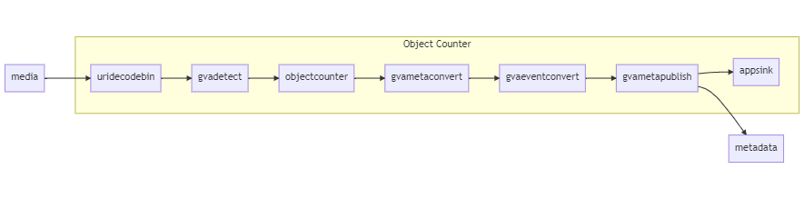

# Creating Extensions

| [ Extensions ](#extensions) | [Event based Extensions](#event-based-extensions) | [References](#references) |

# Extensions

Extensions are a simple way to add functionality to a DL Streamer pipeline using its [python bindings](https://github.com/openvinotoolkit/dlstreamer_gst/wiki/Python) and [GVAPython element](https://github.com/openvinotoolkit/dlstreamer_gst/wiki/gvapython). By extending pipelines using `gvapython` a developer can access frames and analyze and/or update metadata such as detected objects or JSON messages. The DL Streamer [gvapython samples](https://github.com/openvinotoolkit/dlstreamer_gst/blob/master/samples/gst_launch/gvapython/face_detection_and_classification/README.md) provide more examples of the full breadth of capabilities.

An extension is a GVA Python script that is called during pipeline execution. The script is given a frame and any VA Serving parameters defined by the pipeline request.
The extension must be added after the last element that generates data it requires. Below are some examples that cover how extensions can be used to process inference results.
> Note: Make sure to either build VA Serving container with `docker/build.sh` after editing extension code and/or pipeline per [Build script reference](build_script_reference.md) or use --dev mode during run as outlined in [Running Video Analytics Serving](running_video_analytics_serving.md#developer-mode)

## Example: Processing Inference Results

This section will outline an example to show how inference results of object detection can be accessed and used to generate alerts.

### Extension

`process_frame` is the default function invoked by GVA Python.
> Note: The `process_frame` function needs to `return True` in order for the rest of the pipeline to function. In the absence of this statement, the extension runs and exits without executing the subsequent parts of the pipeline which might be useful for extension debug.

In the example below, in `process_frame`, the number of objects in the frame is obtained by counting the number of detected regions. A statement is printed if the number of objects exceeds a threshold value.

```python
class ObjectCounter:
    def __init__(self):
        self._threshold = 0

    def process_frame(self, frame):
        num_objects = len(list(frame.regions()))
        if num_objects > self._threshold:
            print("Object count {} exceeded threshold {}".format(
                num_objects, self._threshold))
        return True
```
### Pipeline

The extension must be added after the last element that generates data it requires. In this case it is placed after `gvadetect`. The template of the object_detection/person_vehicle_bike pipeline is modified by adding a line for the GVA python extension as shown below.
`class`, `module` and `name` are `gvapython` parameters. See [`gvapython` documentation](https://github.com/openvinotoolkit/dlstreamer_gst/wiki/gvapython) for a full list of parameters.

```json
<snip>
"template": ["uridecodebin name=source",
            " ! gvadetect model={models[object_detection][person_vehicle_bike][network]} name=detection",
            " ! gvapython class=ObjectCounter module=/home/video-analytics-serving/extensions/object_counter.py name=object-counter",
            " ! gvametaconvert name=metaconvert ! gvametapublish name=destination",
            " ! appsink name=appsink"
        ]
<snip>
```
### Output

The pipeline can be run with VA Client as follows:
```bash
vaclient/vaclient.sh run object_detection/person_vehicle_bike https://github.com/intel-iot-devkit/sample-videos/blob/master/person-bicycle-car-detection.mp4?raw=true
```

As process_frame runs once per frame, VA Serving output would resemble
```bash
{"levelname": "INFO", "asctime": "2021-08-31 23:12:44,838", "message": "Setting Pipeline 1 State to RUNNING", "module": "gstreamer_pipeline"}
Object count 1 exceeded threshold 0
Object count 1 exceeded threshold 0
<snip>
```

## Example: Setting Extension Parameters

The same object_detection/person_vehicle_bike pipeline will be used to illustrate setting parameters. Instead of hard-coding the value for object count threshold in the previous example, it's possible to set it at request time.
> Note: The `kwarg` parameter is a JSON object and requires the pipeline parameter format to be set to `json` as in the `object-counter` example below. The default value for the object needs to be specified at the parameter level and not in the individual properties due to how default values are applied.

### Extension

The extension can take in the defined parameters via the constructor and use them. In this case, a `count_threshold` parameter is passed in and in `process_frame`, the value is used to check if number of detected regions exceeds the threshold.

```python
class ObjectCounter:
    def __init__(self, count_threshold):
        self._threshold = count_threshold

    def process_frame(self, frame):
        num_objects = len(list(frame.regions()))
        if num_objects > self._threshold:
            print("Object count {} exceeded threshold {}".format(
                num_objects, self._threshold))
        return True
```

### Pipeline

```json
{
    "type": "GStreamer",
    "template": [
        "uridecodebin name=source",
        " ! gvadetect model={models[object_detection][person_vehicle_bike][network]} name=detection",
        " ! gvapython class=ObjectCounter module=/home/video-analytics-serving/extensions/object_counter.py name=object-counter",
        " ! gvametaconvert name=metaconvert ! gvametapublish name=destination",
        " ! appsink name=appsink"
    ],
    "description": "Person Vehicle Bike Detection based on person-vehicle-bike-detection-crossroad-0078",
    "parameters": {
        "type": "object",
        "properties": {
            "detection-device": {
                "element": {
                    "name": "detection",
                    "property": "device"
                },
                "type": "string"
            },
            "detection-model-instance-id": {
                "element": {
                    "name": "detection",
                    "property": "model-instance-id"
                },
                "type": "string"
            },
            "inference-interval": {
                "element": "detection",
                "type": "integer"
            },
            "threshold": {
                "element": "detection",
                "type": "number"
            },
            "object-counter": {
                "element": {
                    "name": "object-counter",
                    "property": "kwarg",
                    "format": "json"
                },
                "type": "object",
                "properties": {
                    "count_threshold": {
                        "type": "integer"
                    }
                },
                "default": {
                    "count_threshold": 0
                }
            }
        }
    }
}
```

### Output

- Running VA Client as shown (parameter-file is optional for extension parameters if defaults are set in pipeline JSON)
  ```bash
   vaclient/vaclient.sh run object_detection/person_vehicle_bike https://github.com/intel-iot-devkit/sample-videos/blob/master/person-bicycle-car-detection.mp4?raw=true
  ```
  Output reflects the default count_threshold i.e 0
  ```bash
  <snip>
  {"levelname": "INFO", "asctime": "2021-08-31 18:49:19,360", "message": "Setting Pipeline 1 State to RUNNING", "module": "gstreamer_pipeline"}
  Object count 1 exceeded threshold 0
  Object count 1 exceeded threshold 0
  <snip>
  ```
- Running VA Client with the following parameter file
  ```json
  {
      "parameters": {
          "object-counter": {
              "count_threshold": 1
          }
      }
  }
  ```
  ```bash
   vaclient/vaclient.sh run object_detection/person_vehicle_bike https://github.com/intel-iot-devkit/sample-videos/blob/master/person-bicycle-car-detection.mp4?raw=true --parameter-file /tmp/sample_parameters.json
  ```
  VA Serving output shows count_threshold is set to 1 per parameter file
  ```bash
  <snip>
  {"levelname": "INFO", "asctime": "2021-09-01 16:28:30,037", "message": "Setting Pipeline 1 State to RUNNING", "module": "gstreamer_pipeline"}
  Object count 2 exceeded threshold 1
  Object count 2 exceeded threshold 1
  <snip>
  ```


# Event based Extensions

The following sections build on the previous extension example that detects when the number of objects in a frame exceeds a specific threshold and additionally demonstrates how to publish a corresponding event using the [`gva_event_meta`](/extensions/gva_event_meta/gva_event_meta.py) module along with [`gva_event_convert`](/extensions/gva_event_meta/gva_event_convert.py),  [`gvametaconvert`](https://github.com/openvinotoolkit/dlstreamer_gst/wiki/gvametaconvert) and [`gvametapublish`](https://github.com/openvinotoolkit/dlstreamer_gst/wiki/gvametapublish).

## Events

> Note: Events are a preview feature and related aspects like their schema are subject to change.

Events are a type of metadata that can be added and read from a frame using methods from the [`gva_event_meta`](/extensions/gva_event_meta/gva_event_meta.py) module. They illustrate how to add and publish additional information using the underlying DL Streamer python bindings.

Events are also used to publish results of the new set of Video Analytics Serving spatial analytics extensions: [object_line_crossing](/extensions/spatial_analytics/object_line_crossing.md)
and [object_zone_count](/extensions/spatial_analytics/object_zone_count.md).

## Event Schema

Events are added to a frame and stored as a JSON message containing a list of event objects. The only required key is `event-type` which is the type of event. It is defined by the extension. An optional field is [related-objects](../extensions/gva_event_meta/schema.py#L10) which is an array of indices to the list of detected objects. This allows a many-to-many relationship between events and the objects that create them (e.g. a social distancing algorithm would have one violate event and a number of objects that were too close to each other).

Here is an example of how events are added to existing metadata showing an event type `object-count-exceeded` with two related objects.

```json

"objects": [
	{"detection":{"bounding_box":{"x_max":0.4753129482269287,"x_min":0.306820273399353,"y_max":0.9987226724624634,"y_min":0.5475195646286011},"confidence":0.8045234084129333,"label":"person","label_id":1},"h":195,"roi_type":"person","w":129,"x":236,"y":237},
	{"detection":{"bounding_box":{"x_max":0.4753129482269287,"x_min":0.306820273399353,"y_max":0.9987226724624634,"y_min":0.5475195646286011},"confidence":0.8045234084129333,"label":"person","label_id":1},"h":195,"roi_type":"person","w":129,"x":200,"y":237}
],

"events": [
      {
          "event-type": "object-count-exceeded",
          "related-objects": [
              0,
              1
          ]
      }
]
```

## Example: Event Generation in Extensions

The following example generates an event type `object-count-exceeded` if more than a pre-defined number of objects are detected in a frame.


### Extension

Few things to note:

* The `count_threshold` pipeline parameter is picked up in the constructor as it was defined in the parameters section of the pipeline.
* Use of the [`gva_event_meta`](/extensions/gva_event_meta/gva_event_meta.py) module's function `add_event()` to populate an event object.
* `attributes` dictionary is meant for storing event related information. It needs to be set to a non-empty value.

```python
import gva_event_meta

class ObjectCounter:
    def __init__(self, count_threshold):
        self._threshold = count_threshold

    def process_frame(self, frame):
        num_objects = len(list(frame.regions()))
        if num_objects > self._threshold:
            attributes = {'num_objects': num_objects}
            gva_event_meta.add_event(frame,
                                     event_type="object_count_exceeded",
                                     attributes=attributes)
        return True
```

### Pipeline

The extension must be added after the last element that generates data it requires. Following the event based extension example, as events are not part of the DL Streamer message schema we also add an extension called [`gva_event_convert`](/extensions/gva_event_meta/gva_event_convert.py) after [`gvametaconvert`](https://github.com/openvinotoolkit/dlstreamer_gst/wiki/gvametaconvert) and before [`gvametapublish`](https://github.com/openvinotoolkit/dlstreamer_gst/wiki/gvametapublish). This reusable extension adds an event list to the published result.

A pipeline using a sample object counting extension would look like this:



and the pipeline JSON would look like this:

```json
{
    "type": "GStreamer",
    "template": [
        "uridecodebin name=source",
        " ! gvadetect model={models[object_detection][person_vehicle_bike][network]} name=detection",
        " ! gvapython class=ObjectCounter module=/home/video-analytics-serving/extensions/object_counter.py name=object-counter",
        " ! gvametaconvert name=metaconvert",
        " ! gvapython module=/home/video-analytics-serving/extensions/gva_event_meta/gva_event_convert.py",
        " ! gvametapublish name=destination",
        " ! appsink name=appsink"
    ],
    "description": "Person Vehicle Bike Detection based on person-vehicle-bike-detection-crossroad-0078",
    "parameters": {
        "type": "object",
        "properties": {
            "detection-device": {
                "element": {
                    "name": "detection",
                    "property": "device"
                },
                "type": "string"
            },
            "detection-model-instance-id": {
                "element": {
                    "name": "detection",
                    "property": "model-instance-id"
                },
                "type": "string"
            },
            "inference-interval": {
                "element": "detection",
                "type": "integer"
            },
            "threshold": {
                "element": "detection",
                "type": "number"
            },
            "object-counter": {
                "element": {
                    "name": "object-counter",
                    "property": "kwarg",
                    "format": "json"
                },
                "type": "object",
                "properties": {
                    "count_threshold": {
                        "type": "integer"
                    }
                },
                "default": {
                    "count_threshold": 1
                }
            }
        }
    }
}
```


### Event Metadata

`event_type` is a required field set during add_event in the extension above.
`num_objects` is a custom optional field set as part of `attributes` in the extension above.
```json
{
    "events": [
        {
            "event-type": "object_count_exceeded",
            "num_objects": 2
        }
    ]
}
```
Another optional field (unused here) is `related_objects` as shown in [line crossing](/extensions/spatial_analytics/object_line_crossing.py) and [zone counting](/extensions/spatial_analytics/object_zone_count.py).

### Output

VA Client can be launched as follows, as no parameter-file is given, the default count_threshold is picked up i.e 1.
```bash
 vaclient/vaclient.sh run object_detection/person_vehicle_bike https://github.com/intel-iot-devkit/sample-videos/blob/master/person-bicycle-car-detection.mp4?raw=true
```
Output snippet is shown, events are fired for object count > 1:
```bash
<snip>
Timestamp 43666666666
- person (0.80) [0.25, 0.03, 0.28, 0.21]
Timestamp 43750000000
- person (0.84) [0.26, 0.02, 0.29, 0.21]
Timestamp 43833333333
- person (0.98) [0.27, 0.02, 0.31, 0.19]
Timestamp 43916666666
- person (0.97) [0.27, 0.02, 0.31, 0.20]
- vehicle (0.76) [0.10, 0.85, 0.30, 1.00]
Event: event-type: object_count_exceeded, num_objects: 2
<snip>
```

# References

- For details on frame inference data classes i.e video frame, regions of interest, tensors see [DL Streamer gstgva Python classes]( https://github.com/openvinotoolkit/dlstreamer_gst/tree/master/python/gstgva).

- For details on more advanced extensions, see the [line crossing](/extensions/spatial_analytics/object_line_crossing.py) and [zone counting](/extensions/spatial_analytics/object_zone_count.py). These include more complex parameters, guidance on how to break down algorithmic implementation to simplify event generation and how to use watermarking for visualizing output.

- Note also how the pipeline definition is used to validate parameter schemas.

- See [object_line_crossing.md](/extensions/spatial_analytics/object_line_crossing.md) and [object_zone_count.md](/extensions/spatial_analytics/object_zone_count.md) for more information and a format for extension documentation.
