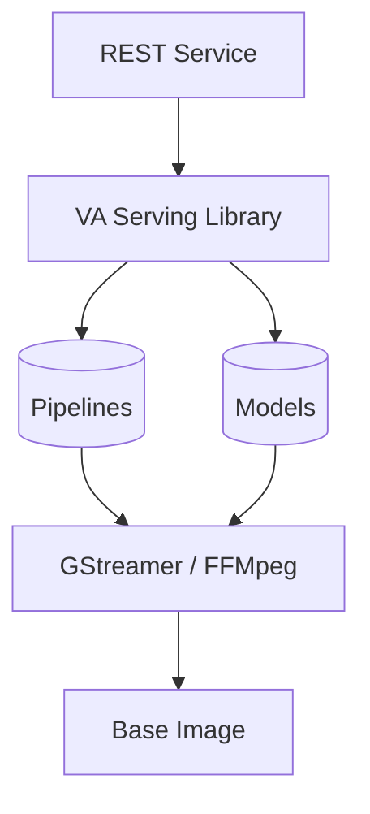

# Customizing, Building and Running Video Analytics Serving Containers
The Video Analytics Serving dockerfile, build and run scripts are
designed to be customized to support different deployment
scenarios. The following sections cover common cases and provide
reference documentation for the tools and files.

Before building be aware of how the docker image is constructed.
* The pipelines that run in VA Serving use a media `framework`, either `gstreamer` or `ffmpeg`.
* The VA Serving image builds on top of a `base image` that must contain the specified framework. This image can obtained from dockerhub or can be built.
* The `pipelines` and the `models` they use can be included in the image.
* VA Serving can be configured to be an OS service or a Python library. 

Note:  
The following descriptions and instructions assume a working knowledge
of docker commands and features. For more information please refer to
[docker](https://docs.docker.com/get-started/) images.


## Video Analytics Serving Docker Image Layers and Build Flow
The Video Analytics Serving stack looks like this


The Video Analytics Serving build flow is separated into four distinct stages.

| Build Stage | Description |
| ----------- | ----------- |
| Video Analytics Base Image | Contains support for either `GStreamer` or `FFMpeg` media frameworks. The base image must include the full set of dependencies for the chosen framework. Example images are [DL Streamer](https://github.com/opencv/gst-video-analytics) or [FFmpeg Video Analytics](https://github.com/VCDP/FFmpeg-patch). When building an image the chosen framework must match the framework in the base image and pipeline definitions. |
| Video Analytics Serving Library | The python code for the VA Serving core that allows construction and control of pipelines. |
| Models and Pipelines | The pipeline description files and the models they use. |
| REST Service | A service that implements a REST API that reflects capabilities of the Video Analytics Serving library. |

## Example Build Scenarios
### Building with Open Visual Cloud Base Images
Here an Open Visual Cloud Ubuntu 18.04 base image with GStreamer framework is used. Default pipelines and models are included in the image and the application is the REST service. Note that `--framework gstreamer` is only used to pick up the right docker image as we don't specify it. 
As GStreamer is the default framework the `--framework gstreamer` option can be omitted for both build and run command lines.

```bash
./docker/build.sh --framework gstreamer --base openvisualcloud/xeone3-ubuntu1804-analytics-gst
```
And similarly for ffmpeg:
```bash
./docker/build.sh --framework ffmpeg --base openvisualcloud/xeone3-ubuntu1804-analytics-ffmpeg 
```
### Building with Open VINO Base Images
Here we use an OpenVINO base image which includes DL Streamer and thus the GStreamer framework.
```
./docker/build.sh --base openvino/ubuntu18_runtime
```

### Specifying Pipelines and Models at Build Time
By default the sample pipelines and models from the VA Serving code base and are included in the image. 
However alternative pipelines and models can be included in the image by specifying their location at build time. 
Here we extend the previous Open Visual Cloud GStreamer example by specifying paths to external pipeline and model directories.
```bash
./docker/build.sh --framework gstreamer --base openvisualcloud/xeone3-ubuntu1804-analytics-gst --pipelines /path/to/my-pipelines --models /path/to/my-models 
```

## Example Run Scenarios
### Running Default Image
This command runs default `gstreamer` image which contains the REST service, mounting /tmp so host can access pipeline file output:
```bash
$ docker/run.sh -v /tmp:/tmp
```
Now from a different shell use curl to act as a sample client from the host. Let's start with a simple request to get loaded pipelines.
```bash
$ curl localhost:8080/pipelines
[
  {
    "description": "Object Detection Pipeline",
    "name": "object_detection",
    <snip>
    "type": "GStreamer",
    "version": "1"
  },
  {
    "description": "Emotion Recognition Pipeline",
    "name": "emotion_recognition",
    <snip>
    "type": "GStreamer",
    "version": "1"
  }
]
```
Now run a pipeline by selecting `object_detection`, specifying an input stream and routing output to /tmp/results.txt. As /tmp is mounted on the host, we can see the file.
```bash
$ curl localhost:8080/pipelines/object_detection/1 -X POST -H 'Content-Type: application/json' -d '{ "source": { "uri": "https://github.com/intel-iot-devkit/sample-videos/blob/master/bottle-detection.mp4?raw=true", "type": "uri" }, "destination": { "type": "file", "path": "/tmp/results.txt", "format":"json-lines"}}'
$ tail -f /tmp/results.txt
{"objects":[{"detection":{"bounding_box":{"x_max":0.8810903429985046,"x_min":0.77934330701828,"y_max":0.8930767178535461,"y_min":0.3040514588356018},"confidence":0.5735679268836975,"label":"bottle","label_id":5},"h":213,"roi_type":"bottle","w":65,"x":499,"y":109}],"resolution":{"height":360,"width":640},"source":"https://github.com/intel-iot-devkit/sample-videos/blob/master/bottle-detection.mp4?raw=true","timestamp":972067039}
```
To stop the container, you can use CTRL+C but it is preferred that you stop it cleanly with `docker stop`. You must make a note of the image name, it defaults to `video-analytics-serving-gstreamer`
```bash
$ docker stop video-analytics-serving-gstreamer
```

### Run FFMpeg Image
As above, but this time use the `--framework ffmpeg` as the image name will be `video-analytics-serving-ffmpeg`. This does not select the framework as that is already defined by the image.
```bash
$ docker/run.sh --framework ffmpeg -v /tmp:/tmp
```

### Specifying Pipelines and Models at Run Time
You also have the option of overriding the pipelines and models included with the image. 
Note that the external pipelines must match the framework included in the image or they will fail to run.
The run script will automatically perform a volume mount of the external pipeline and model directories.
```bash
$ ./docker/run.sh --framework gstreamer --pipelines /path/to/my-pipelines --models /path/to/my-models
```

### Running in Developer Mode and Using Python Sample Client
Here you start the container in developer mode which drops you into a bash shell so you have to start the service manually with command `python3 -m vaserving`. The service is now running with the latest local source code, pipelines and models allowing quick development. As framework has not been selected, service defaults to `gstreamer`
```bash
$ docker/run.sh --dev
vaserving@my-host:~$ python3 -m vaserving 
```
Now we'll use the sample python client to connect to the service. This will issue the same request as the curl command line to start the pipeline and then reads from the destination results file, prettifying the json output.
```bash
$ samples/sample.py
Launching with options:
Namespace(destination='/tmp/results.txt', pipeline='object_detection', repeat=1, source='https://github.com/intel-iot-devkit/sample-videos/blob/master/bottle-detection.mp4?raw=true', verbose=True)
Starting Pipeline: http://localhost:8080/pipelines/object_detection/1
Pipeline Status:
{
    "avg_fps": 0,
    "elapsed_time": 0.003255605697631836,
    "id": 2,
    "start_time": 1591218219.8982496,
    "state": "QUEUED"
}
```

## Further Reading
See reference documentation on [building](building.md) and [running](running.md).

