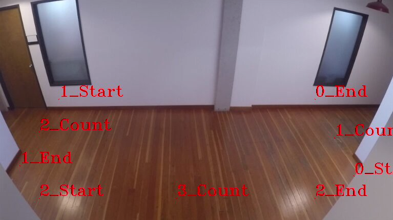

# Object Line Crossing
The object line crossing spatial analytics extension is used in tandem with gvatrack to determine when tracked objects cross virtually defined lines supplied to the extension.

## Parameters
The extension takes the following parameters. All parameters are optional for the pipeline to run.

### lines
A list of line definitions, which are objects containing the following fields:
* `name` the name of the line for use in event reporting.
* `line` a tuple of (x,y) coordinates defining the start and end of the directional line segment.

**If this parameter is not set, the extension defaults to an empty list and will not check for line crossings.**

```json
"lines": [
    {
        "name": "hallway_right",
        "line": [[0.9,0.8],[0.8,0.45]]
    },
    {
        "name": "hallway_left",
        "line": [[0.15,0.45],[0.05,0.75]]
    },
    {
        "name": "hallway_bottom",
        "line": [[0.1,0.9],[0.8,0.9]]
    }
]
```
### enable_watermark
A `boolean` flag that defaults to `false`. If set to `true` annotations are added, with `n_start`, `n_end` to mark the start and end of line `n` from lines (list is 0 based) will be added to rendered watermark images. Another annotation `n_count` midway along the line indicates the total number of crossing events for that line.

### log_level
The [logging level](https://docs.python.org/3.8/library/logging.html#logging-levels) defined as a `string`. Defaults to "INFO".

## Event Output
If a tracked object crosses any of the lines, an event of type `object-line-crossing` will be created with the following fields.
* `line-name`: name of the associated line
* `related-objects`: array containing indexes of the detected objects that crossed the line
* `directions` : array containing directions which can be `clockwise`, `counterclockwise`, or `parallel`. The orientation is determined from from line-start to line-end.
* `clockwise-total` : total number of clockwise crossings
* `counterclockwise-total` : total number of counter clockwise crossings
* `total` : total number of crossings

JSON example is shown below

```json
{
   "event-type":"object-line-crossing",
   "line-name":"hallway_bottom",
   "related-objects": [
      0
   ],
   "directions":[
      "counterclockwise"
   ],
   "clockwise-total":"0",
   "counterclockwise-total":"1",
   "total":"1"
}
```

## Line Crossing Algorithm
The algorithm to calculate line crossing is based on the following article:
https://www.geeksforgeeks.org/check-if-two-given-line-segments-intersect/

## Example Run
Intel(R) Deep Learning Streamer (Intel(R) DL Streamer) Pipeline Server comes with an [example configuration](../../client/parameter_files/object-line-crossing.json) for object-line-crossing

1. [Build](../../README.md#building-the-microservice) & [Run](../../README.md#running-the-microservice) the Pipeline Server

2. Run object-line-crossing pipeline with pipeline_client using example parameter file:
    ```
   ./client/pipeline_client.sh run object_tracking/object_line_crossing https://github.com/intel-iot-devkit/sample-videos/blob/master/people-detection.mp4?raw=true --parameter-file client/parameter_files/object-line-crossing.json
    ```
    You will see events among the detections in pipeline_client output:
    ```
    Timestamp 43916666666
    - person (1.00) [0.38, 0.47, 0.60, 0.91] {'id': 7}
    Timestamp 44000000000
    - person (1.00) [0.36, 0.38, 0.58, 0.81] {'id': 7}
    Event: event-type: object-line-crossing, line-name: hallway_bottom, related-objects: [0], directions: ['counterclockwise'], clockwise-total: 1, counterclockwise-total: 8, total: 9
    Timestamp 44083333333
    - person (0.92) [0.38, 0.29, 0.58, 0.98] {'id': 7}
    Event: event-type: object-line-crossing, line-name: hallway_bottom, related-objects: [0], directions: ['clockwise'], clockwise-total: 2, counterclockwise-total: 8, total: 10
    Timestamp 44166666666
    - person (0.99) [0.38, 0.31, 0.57, 0.98] {'id': 7}
    ```

## Watermark Example
1. Open the [example configuration](../../client/parameter_files/object-line-crossing.json) and add `enable_watermark` as follows:
    ```
    "object-line-crossing-config": {
        "lines": [
            <snip>
        ],
        "enable_watermark": true
    }
    ```
2. Rebuild and Run the Pipeline Server with additional flag `--enable-rtsp`
    ```
    ./docker/run.sh -v /tmp:/tmp --enable-rtsp

3. Run object-line-crossing pipeline with pipeline_client using example parameter file with additional parameter `rtsp-path`. Note that `rtsp-path` is set to `pipeline-server`, this path is    what will be used to view the rtsp stream:
    ```
   ./client/pipeline_client.sh run object_tracking/object_line_crossing https://github.com/intel-iot-devkit/sample-videos/blob/master/people-detection.mp4?raw=true --parameter-file client/parameter_files/object-line-crossing.json --rtsp-path pipeline-server
    ```

4. Open up a media player with network stream viewing (VLC for example) and connect to `rtsp:://<host ip>:8554/pipeline-server`. The stream is real time so you make need to rerun the pipeline request to see the stream. You will see people-detection.mp4 with an overlay of points. Each line x, has a start point (x_Start) and end point (x_End). At the midpoint between start and end, a count displays how many objects have crossed the line.

    