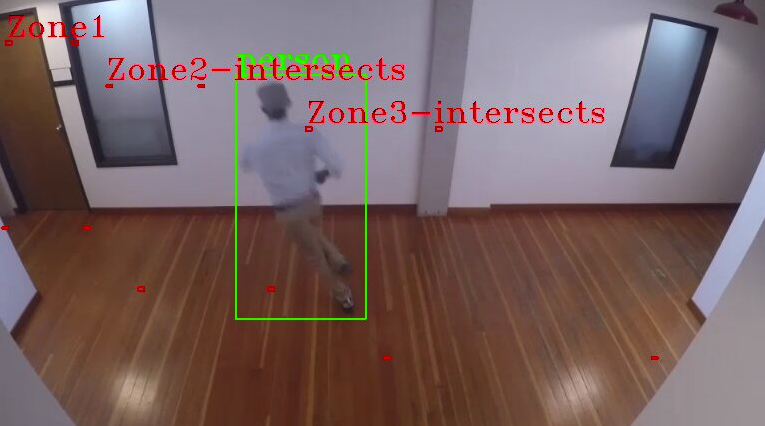

# Zone Event Detection
The Zone Event Detection AI Skill is used to determine if detected objects reside in polygons that this Skill takes as inputs.

## Parameters
The extension takes the following parameters. All parameters are optional for the pipeline to run.

### zones
A list of zone definitions which are objects containing the following fields.
* `name` : the name of the zone for use in event reporting.
* `polygon` : A list of four vertices (a tuple of x,y coordinates) which make up the bounds of the polygon.

**If this parameter is not set, the extension defaults to an empty list and will not check for zone detections.**

```json
"zones": [
    {
        "name": "Zone1",
        "polygon": [[0.01,0.10],[0.005,0.53],[0.11,0.53],[0.095,0.10]]
    },
    {
        "name": "Zone2",
        "polygon": [[0.14,0.20],[0.18,0.67],[0.35,0.67],[0.26,0.20]]
    },
    {
        "name": "Zone3",
        "polygon": [[0.40,0.30],[0.50,0.83],[0.85,0.83],[0.57,0.30]]
    }
]
```
### enable_watermark
A `boolean` flag that defaults to `false`. If set to `true` marks the vertices of all zones and annotates the first vertex with the zone name.

### log_level
The [logging level](https://docs.python.org/3.8/library/logging.html#logging-levels) defined as a `string`. Defaults to "INFO".

## Event Output
If a tracked object crosses any of the lines, an event of type `object-zone-count` will be created with the following fields.
* `zone-name`: name of the associated line
* `related-detections`: array containing the array indices of the detected objects in the zone
* `status` : array containing the status of the detected objects in the zone. Values can be `"within"` to indicate that the object is fully within the zone or `"intersects"` if it touches any of the vertices.
* `zone-count` : total number of objects in the zone

```json
{
   "event-type":"zoneCrossing",
   "zone-name":"Zone1",
   "related-objects":[
      0, 1, 4
   ],
   "status":[
      "within",
      "within",
      "intersects"
   ],
   "zone-count" : 3
}
```
## Example Run
Intel(R) Deep Learning Streamer (Intel(R) DL Streamer) Pipeline Server comes with an [example configuration](../../client/parameter_files/object-zone-count.json) for object-zone-count

1. [Build](../../README.md#building-the-microservice) & [Run](../../README.md#running-the-microservice) the Pipeline Server

2. Run object-zone-count pipeline with pipeline_client using example parameter file:
    ```
   ./client/pipeline_client.sh run object_detection/object_zone_count https://github.com/intel-iot-devkit/sample-videos/blob/master/people-detection.mp4?raw=true --parameter-file client/parameter_files/object-zone-count.json
    ```
    You will see events among the detections in pipeline_client output:
    ```
    Timestamp 45000000000
    - person (0.76) [0.28, 0.15, 0.42, 0.72]
    Event: event-type: object-zone-count, zone-name: Zone2, related-objects: [0], status: ['intersects'], zone-count: 1
    Event: event-type: object-zone-count, zone-name: Zone3, related-objects: [0], status: ['intersects'], zone-count: 1
    Timestamp 45166666666
    - person (0.57) [0.24, 0.16, 0.35, 0.69]
    Event: event-type: object-zone-count, zone-name: Zone2, related-objects: [0], status: ['intersects'], zone-count: 1
    ```

## Watermark Example
1. Open the [example configuration](../../client/parameter_files/object-zone-count.json) and add `enable_watermark` as follows:
    ```
    "object-zone-count-config": {
        "zones": [
            <snip>
        ],
        "enable_watermark": true
    }
    ```
2. Rebuild and Run the Pipeline Server with additional flag `--enable-rtsp`
    ```
    ./docker/run.sh -v /tmp:/tmp --enable-rtsp

3. Run object-zone-count pipeline with pipeline_client using example parameter file with additional parameter `rtsp-path`. Note that `rtsp-path` is set to `pipeline-server`, this path is    what will be used to view the rtsp stream:
    ```
   ./client/pipeline_client.sh run object_detection/object_zone_count https://github.com/intel-iot-devkit/sample-videos/blob/master/people-detection.mp4?raw=true --parameter-file client/parameter_files/object-zone-count.json --rtsp-path pipeline-server
    ```

4. Open up a media player with network stream viewing (VLC for example) and connect to `rtsp:://<host ip>:8554/pipeline-server`. The stream is real time so you might want to setup your media player ahead of time. You will see people-detection.mp4 with an overlay of points. Each zone has a start point which has a label of the zone name. Other points of the zone are not labeled. If an object `intersects` or is `within` a zone the label is updated to reflect that.

    