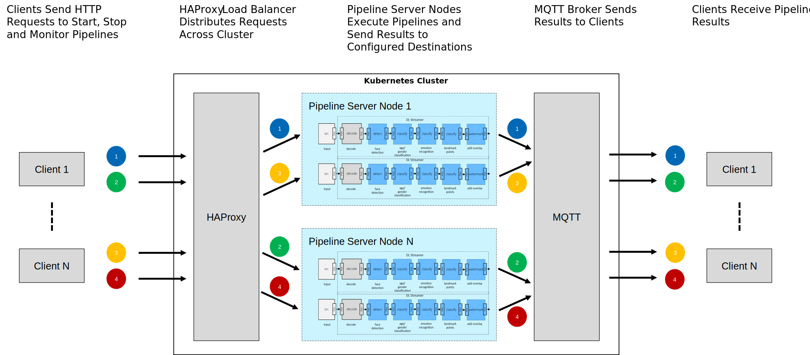

# Kubernetes Deployment with Load Balancing

| [Installing Microk8s](#installing-microk8s) | [Adding Initial Nodes](#adding-initial-nodes-to-the-cluster) | [Building and Deploying Services](#building-and-deploying-services-to-the-cluster) | [Adding Nodes to Existing Deployment](#adding-nodes-to-an-existing-deployment) | [Sending Requests](#sending-pipeline-server-requests-to-the-cluster) | [Uninstalling](#uninstalling) | [Examples](#examples) | [Useful Commands](#useful-commands) | [Limitations](#limitations) |

This sample demonstrates how to set up a Kubernetes cluster using MicroK8s, how to deploy Intel(R) Deep Learning Streamer (Intel(R) DL Streamer) Pipeline Server to the cluster, and how to use HAProxy to load balance requests.



### Definitions

| Term | Definition |
|---|---|
| Pipeline Server | [Intel(R) DL Streamer Pipeline Server](https://github.com/dlstreamer/pipeline-server) microservice thats runs pipelines. |
| HAProxy | [HAProxy](https://www.haproxy.com/) open source load balancer and application delivery controller. |
| MicroK8s | [microk8s](https://microk8s.io/) minimal production Kubernetes distribution. |
| MQTT | [MQTT](https://hub.docker.com/_/eclipse-mosquitto) open source message bus. |
| Node | Physical or virtual machine. |
| Leader | Node hosting the Kubernetes control plane to which worker nodes are added. The leader node can also host pipeline servers and run pipelines. |
| Worker | Nodes hosting pipeline servers. Worker nodes are added to increase the computational resources of the cluster. |
| Pod  | The smallest deployable unit of computing in a Kubernetes cluster, typically a single container. |
| leader-ip | Host IP address of Leader. |

### Prerequisites

The following steps, installation and deployment scripts have been tested on Ubuntu 20.04. Other operating systems may have additional requirements and are beyond the scope of this document.

## Installing MicroK8s

For each node that will be in the cluster run the following commands to install MicroK8s along with its dependencies. These steps must be performed on each node individually. Please review the contents of [microk8s/install.sh](microk8s/install.sh) and [microk8s/install_addons.sh](./microk8s/install_addons.sh) as these scripts will install additional components on your system as well as make changes to your groups and environment variables.

### Step 1: Install MicroK8s Base

#### Command
```bash
cd ./samples/kubernetes
sudo -E ./microk8s/install.sh
```

#### Expected Output
```text
<snip>
Assigning <user name> to microk8s group
```
>
> NOTE: If you are running behind a proxy please ensure that your `NO_PROXY` and `no_proxy` environment variables are set correctly to allow cluster nodes to communicate directly. You can run these commands to set this up automatically:
> ```bash
> UPDATE_NO_PROXY=true sudo -E ./microk8s/install.sh
> su - $USER
> ```
>

### Step 2: Activate Group Membership

Your user is now a member of a newly added 'microk8s' group. However, the current terminal session will not be aware of this until you issue this command:

#### Command

```bash
newgrp microk8s
groups | grep microk8s
```

#### Expected Output
```text
<snip> microk8s <snip>
```

### Step 3: Install MicroK8s Add-Ons

Next we need to install add-on components into the cluster. These enable docker registry and dns.

#### Command

```bash
./microk8s/install_addons.sh
```

Note that this script may take **several minutes** to complete.

#### Expected Output

```text
Started.
Metrics-Server is enabled
DNS is enabled
Ingress is enabled
Metrics-Server is enabled
DNS is enabled
The registry is enabled
```

### Step 4: Wait for Kubernetes System Pods to Reach Running State

At this point we need to wait for the Kubernetes system pods to reach the running state. This may take a few minutes.

Check that the installation was successful by confirming `STATUS` is `Running` for all pods. Pods will cycle through `ContainerCreating`, `Pending`, and `Waiting` states but all should eventually reach the `Running` state. After a few minutes if all pods do not reach the `Running` state refer to [application cluster troubleshooting tips](https://kubernetes.io/docs/tasks/debug-application-cluster/debug-pod-replication-controller/) for more help.

> Troubleshooting Tip: If you see `Pending` or `ContainerCreating` after waiting more than a few minutes, you may need to modify your environment variables with respect to proxy settings and restart MicroK8s. Do this by running `microk8s stop`, modifying the environment variables in your shell, and then running `microk8s start`. Then check the status of pods by running this command again.

#### Command

```bash
microk8s kubectl get pods --all-namespaces
```

#### Expected Output

```text
NAMESPACE            NAME                                         READY   STATUS    RESTARTS   AGE
kube-system          calico-node-mhvlc                            1/1     Running   0          4m28s
kube-system          metrics-server-8bbfb4bdb-pl6g7               1/1     Running   0          3m1s
kube-system          calico-kube-controllers-f7868dd95-mkjjk      1/1     Running   0          4m30s
kube-system          dashboard-metrics-scraper-78d7698477-pgpkj   1/1     Running   0          86s
kube-system          coredns-7f9c69c78c-8vjr4                     1/1     Running   0          86s
ingress              nginx-ingress-microk8s-controller-rjcpr      1/1     Running   0          86s
kube-system          kubernetes-dashboard-85fd7f45cb-h82gk        1/1     Running   0          86s
kube-system          hostpath-provisioner-5c65fbdb4f-42pdn        1/1     Running   0          86s
container-registry   registry-9b57d9df8-vtmsj                     1/1     Running   0          86s
```


### Step 5: Setup Proxy Server DNS
> Note: This step is required if you are running behind proxy, skip otherwise.

Use the following steps to set up the MicroK8s DNS service correctly.

#### 1. Identify host network’s configured DNS servers

##### Command

```bash
systemd-resolve --status | grep "Current DNS" --after-context=3
```

##### Expected Output

```text
Current DNS Server: 10.22.1.1
       DNS Servers: <ip1>
                    <ip2>
                    <ip3>
```

#### 2. Disable MicroK8s DNS

##### Command

```bash
microk8s disable dns
```

##### Expected Output

```text
Disabling DNS
Reconfiguring kubelet
Removing DNS manifest
serviceaccount "coredns" deleted
configmap "coredns" deleted
deployment.apps "coredns" deleted
service "kube-dns" deleted
clusterrole.rbac.authorization.k8s.io "coredns" deleted
clusterrolebinding.rbac.authorization.k8s.io "coredns" deleted
DNS is disabled
```

#### 3. Enable DNS with Host DNS Server

##### Command

```bash
microk8s enable dns:<ip1>,<ip2>,<ip3>
```

##### Expected Output

```text
Enabling DNS
Applying manifest
serviceaccount/coredns created
configmap/coredns created
deployment.apps/coredns created
service/kube-dns created
clusterrole.rbac.authorization.k8s.io/coredns created
clusterrolebinding.rbac.authorization.k8s.io/coredns created
Restarting kubelet
DNS is enabled
```

#### 4. Confirm Update

##### Command

```bash
sh -c "until microk8s.kubectl rollout status deployments/coredns -n kube-system -w; do sleep 5; done"
```

##### Expected Output

```text
deployment "coredns" successfully rolled out
```

## Adding Initial Nodes to the Cluster

> Note: This step is only required if you have 2 or more nodes, skip otherwise.

### Step 1: Select Leader and Add Nodes

Choose one of your nodes as the `leader` node.

For each additional node that will be in the cluster, issue the following command on the `leader` node. You will need to do this once for each node you want to add.

#### Command

```bash
microk8s add-node
```

#### Expected Output

You should see output as follows, including the IP address of the primary/controller host and unique token for the node you are adding to use during connection to the cluster.

```bash
From the node you wish to join to this cluster, run the following:
microk8s join <leader-ip>:25000/02c66e66e811fe2c697b1cd5d31bfba2/023e49528889

If the node you are adding is not reachable through the default interface you can use one of the following:
 microk8s join <leader-ip>:25000/02c66e66e811fe2c697b1cd5d31bfba2/023e49528889
 microk8s join 172.17.0.1:25000/02c66e66e811fe2c697b1cd5d31bfba2/023e49528889
```

### Step 2: Join Nodes to Cluster

Run  `join` command shown in the above response on each `worker node` to be added.

#### Command

```bash
microk8s join <leader-ip>:25000/02c66e66e811fe2c697b1cd5d31bfba2/023e49528889
```

#### Expected Output

```text
Contacting cluster at <leader-ip>
Waiting for this node to finish joining the cluster. ..
```

If you encounter an error `Connection failed. Invalid token (500)` your token may have expired or you already used it for another node. To resolve, run the `add-node` command on the leader node to get a new token.

### Step 3: Confirm Cluster Nodes

To confirm what nodes are running in your cluster, run:

#### Command

```bash
microk8s kubectl get no
```

#### Expected Output

```text
NAME         STATUS   ROLES    AGE   VERSION
vcplab003    Ready    <none>   3d    v1.21.5-3+83e2bb7ee39726
vcplab002    Ready    <none>   84s   v1.21.5-3+83e2bb7ee39726
```

## Building and Deploying Services to the Cluster

Follow the steps below to build and deploy the Pipeline Server, HAProxy and MQTT services to the cluster.

### Step 1: Deploy MQTT

This will enable listening to metadata using MQTT broker.

#### Command

```bash
./mqtt/deploy.sh
```

#### Expected Output

```text
MQTT instance is up and running
```

### Step 2: Build and Deploy Pipeline Server(s)

#### Update Configuration with Number of Replicas

Update the number of replicas in the Pipeline Server deployment configuration [`pipeline-server-worker/pipeline-server.yaml#L8`](./pipeline-server-worker/pipeline-server.yaml#L8) to match the number of nodes in the cluster.

#### Build and Deploy

This command adds host system proxy settings to `pipeline-server-worker/pipeline-server.yaml` and deploys it.

 > The following command uses the pre built docker image from [intel/dlstreamer-pipeline-server:0.7.1](https://hub.docker.com/r/intel/dlstreamer-pipeline-server). To use a local image instead run `BASE_IMAGE=dlstreamer-pipeline-server-gstreamer:latest ./pipeline-server-worker/build.sh`

##### Command

```bash
./pipeline-server-worker/build.sh
./pipeline-server-worker/deploy.sh
```

##### Expected Output

```text
All Pipeline Server instances are up and running
```

#### Check Status

##### Command

```bash
microk8s kubectl get pods
```

##### Expected Output
```text
NAME                                          READY   STATUS
mqtt-deployment-7d85664dc7-f976h              1/1     Running
pipeline-server-deployment-7479f5d494-2wkkk   1/1     Running
```

### Step 3: Build and Deploy HAProxy

This will enable load balancing of Pipeline Server REST Requests through the cluster on port 31000.

> Note: Pipeline Server pod(s) must be up and running before building and deploying HAProxy.

#### Build and Deploy

##### Command

```bash
./haproxy/build.sh
./haproxy/deploy.sh
```

##### Expected Output

```text
HAProxy Service started
```

#### Check Status

Check status of all pods

##### Command

```bash
microk8s kubectl get pods
```

##### Expected Output

```text
NAME                                          READY   STATUS
mqtt-deployment-7d85664dc7-f976h              1/1     Running
pipeline-server-deployment-7479f5d494-2wkkk   1/1     Running
haproxy-deployment-7d79cf66f5-4d92n           1/1     Running
```

## Adding Nodes to an Existing Deployment

### Step 1: Prepare New Nodes

To add nodes to an existing deployment first follow the steps outlined in [Installing MicroK8s](#installing-microk8s) and [Joining Nodes to the Cluster](#joining-nodes-to-the-cluster) for the nodes to be added to the deployment.

### Step 2: Update Pipeline Server Configuration with Number of Replicas

Update the number of replicas in the Pipeline Server deployment configuration [`pipeline-server-worker/pipeline-server.yaml#L8`](./pipeline-server-worker/pipeline-server.yaml#L8) to match the number of nodes in the cluster.

### Step 3: Redeploy Pipeline Server

Using the node selected as the `leader`, redploy the pipeline server instances.

#### Command

```bash
./pipeline-server-worker/deploy.sh
```

#### Expected Output

```text
All Pipeline Server instances are up and running
```

### Step 4: Check Status

#### Command

```bash
microk8s kubectl get pods | grep 'pipeline-server'
```

#### Expected Output

```text
pipeline-server-deployment-7479f5d494-2wkkk   1/1     Running
pipeline-server-deployment-7479f5d494-2knop   1/1     Running
```

### Step 5: Rebuild and Redeploy HAProxy

This will add the new Pipeline Server pod(s) to the HAProxy config.

> Note: Pipeline Server pod(s) must be up and running before building and deploying HAProxy.

#### Command

```bash
./haproxy/build.sh
./haproxy/deploy.sh
```

#### Expected Output

```text
HAProxy Service started
```

### Step 6: Check Status

#### Command

```bash
microk8s kubectl get pods
```

#### Expected Output

```text
NAME                                          READY   STATUS
pipeline-server-deployment-7479f5d494-2wkkk   1/1     Running
pipeline-server-deployment-7479f5d494-2knop   1/1     Running
haproxy-deployment-7d79cf66f5-4d92n           1/1     Running
mqtt-deployment-7d85664dc7-f976h              1/1     Running
```

## Sending Pipeline Server Requests to the Cluster

Once pods have been deployed, clients can send pipeline server requests to the cluster via the leader node. The HAProxy service is responsible for load balancing pipeline server requests accross the cluster using a `round-robin` algorithm.

When pipeline servers are deployed, they can also be configured to stop taking new requests based on a `MAX_RUNNING_PIPELINES` setting and/or a `TARGET_FPS` setting.

Pipeline servers that reach the configured `MAX_RUNNING_PIPELINES` or have a pipeline instance running with an FPS below the `TARGET_FPS` become unavailable for new requests.

Once all the pipeline servers in the cluster become unavailable, clients receive a `503 Service Unavailable` error from the load balancer. Both `MAX_RUNNING_PIPELINES` and `TARGET_FPS` are set in `pipeline-server-worker/pipeline-server.yaml`.

### Step 1: Start Pipelines on the Cluster

As an example, the following `curl` request starts processing the `homes_00425.mkv` media file with the `object_detection/person_vehicle_bike` pipeline.
This command can be issued multiple times to start multiple concurrent pipelines on the cluster.

> In below command, replace `<leader-ip>` at two places with host ip address of the leader node.

#### Command

```bash
 curl <leader-ip>:31000/pipelines/object_detection/person_vehicle_bike -X POST -H \
  'Content-Type: application/json' -d \
  '{
    "source": {
        "uri": "https://lvamedia.blob.core.windows.net/public/homes_00425.mkv",
        "type": "uri"
    },
    "destination": {
        "metadata": {
            "type": "mqtt",
            "host": "<leader-ip>:31020",
            "topic": "inference-results"
        }
    }
  }'
```

#### Expected Output

```text
59896b90853511ec838b0242ac110002
```

### Step 2: View Pipeline Results via MQTT

#### Command

```bash
docker run -it  --entrypoint mosquitto_sub  eclipse-mosquitto:1.6 --topic inference-results -p 31020 -h <leader-ip>
```

#### Expected Output

```text
{"objects":[{"detection":{"bounding_box":{"x_max":0.18142173439264297,"x_min":0.0012132003903388977,"y_max":0.5609017014503479,"y_min":0.05551356077194214},"confidence":0.949055016040802,"label":"person","label_id":1},"h":364,"roi_type":"person","w":231,"x":2,"y":40},{"detection":{"bounding_box":{"x_max":0.8925144076347351,"x_min":0.36785489320755005,"y_max":0.9984934628009796,"y_min":0.12739971280097961},"confidence":0.9934169054031372,"label":"vehicle","label_id":2},"h":627,"roi_type":"vehicle","w":672,"x":471,"y":92},{"detection":{"bounding_box":{"x_max":0.6342829465866089,"x_min":0.4171762466430664,"y_max":0.1727554127573967,"y_min":0.006322525441646576},"confidence":0.9811769723892212,"label":"vehicle","label_id":2},"h":120,"roi_type":"vehicle","w":278,"x":534,"y":5},{"detection":{"bounding_box":{"x_max":0.9924979209899902,"x_min":0.8348081111907959,"y_max":0.6326080560684204,"y_min":0.03754556179046631},"confidence":0.51938396692276,"label":"vehicle","label_id":2},"h":428,"roi_type":"vehicle","w":202,"x":1069,"y":27}],"resolution":{"height":720,"width":1280},"source":"https://lvamedia.blob.core.windows.net/public/homes_00425.mkv","timestamp":34233000000}
{"objects":[{"detection":{"bounding_box":{"x_max":0.17737998813390732,"x_min":0.0006547793745994568,"y_max":0.5608647763729095,"y_min":0.05572208762168884},"confidence":0.9445104598999023,"label":"person","label_id":1},"h":364,"roi_type":"person","w":226,"x":1,"y":40},{"detection":{"bounding_box":{"x_max":0.8915983140468597,"x_min":0.3666575849056244,"y_max":0.9976192712783813,"y_min":0.1277613639831543},"confidence":0.9927189350128174,"label":"vehicle","label_id":2},"h":626,"roi_type":"vehicle","w":672,"x":469,"y":92},{"detection":{"bounding_box":{"x_max":0.6342107653617859,"x_min":0.4164556860923767,"y_max":0.17355699837207794,"y_min":0.006252080202102661},"confidence":0.980128824710846,"label":"vehicle","label_id":2},"h":120,"roi_type":"vehicle","w":279,"x":533,"y":5}],"resolution":{"height":720,"width":1280},"source":"https://lvamedia.blob.core.windows.net/public/homes_00425.mkv","timestamp":34267000000}
{"objects":[{"detection":{"bounding_box":{"x_max":0.1800042986869812,"x_min":0.0009236931800842285,"y_max":0.5527437925338745,"y_min":0.04479485750198364},"confidence":0.8942767381668091,"label":"person","label_id":1},"h":366,"roi_type":"person","w":229,"x":1,"y":32},{"detection":{"bounding_box":{"x_max":0.8907946944236755,"x_min":0.3679085373878479,"y_max":0.9973113238811493,"y_min":0.12812647223472595},"confidence":0.9935075044631958,"label":"vehicle","label_id":2},"h":626,"roi_type":"vehicle","w":669,"x":471,"y":92},{"detection":{"bounding_box":{"x_max":0.6346513032913208,"x_min":0.4170849323272705,"y_max":0.17429469525814056,"y_min":0.006016984581947327},"confidence":0.9765880107879639,"label":"vehicle","label_id":2},"h":121,"roi_type":"vehicle","w":278,"x":534,"y":4},{"detection":{"bounding_box":{"x_max":0.9923359751701355,"x_min":0.8340855240821838,"y_max":0.6327562630176544,"y_min":0.03546741604804993},"confidence":0.5069465041160583,"label":"vehicle","label_id":2},"h":430,"roi_type":"vehicle","w":203,"x":1068,"y":26}],"resolution":{"height":720,"width":1280},"source":"https://lvamedia.blob.core.windows.net/public/homes_00425.mkv","timestamp":34300000000}
```

## Uninstalling

### Step 1: Undeploy Pipeline Server, HAProxy and MQTT services

#### Remove Pipeline Server deployment

```bash
microk8s kubectl delete -f pipeline-server-worker/pipeline-server.yaml
```

#### Remove HAProxy deployment

```bash
microk8s kubectl delete -f haproxy/haproxy.yaml
```

#### Remove MQTT deployment

```bash
microk8s kubectl delete -f mqtt/mqtt.yaml
```

### Step 2: Remove Node

#### Confirm running nodes

To confirm what nodes are running in your cluster, run:

##### Command

```bash
microk8s kubectl get no
```

##### Expected Output

```text
NAME           STATUS     ROLES    AGE   VERSION
<node-name>    Ready      <none>   96d   v1.21.9-3+5bfa682137fad9
```

#### Drain Node

Drain the node, run below command in worker node you want to remove

##### Command

```bash
microk8s kubectl drain <node-name>
```

##### Expected Output

```text
<snip>
node/<node-name> drained
```

#### Leave Cluster

Run below command in worker node you want to remove to leave the cluster

```bash
microk8s leave
```

#### Remove Node

Run below command on **leader node**

```bash
microk8s remove-node <node-name/ip>
```

### Step 3: Uninstall MicroK8s

#### Command

```bash
./microk8s/uninstall.sh
```

#### Expected Output

```text
==========================
Remove/Purge microk8s
==========================
microk8s removed
```

## Examples

These examples will show the following with a target of 30fps per stream:

- Running a single stream on a single node and exceeding target fps indicating a stream density of at least 1.
- Running two streams on a single node and seeing both of them processing below target fps showing a stream density of 2 cannot be met.
- Adding a second node to cluster and seeing two streams exceeding target fps, thus doubling stream density to 2.

The examples require [vaclient](../../vaclient/README.md) so the container `dlstreamer-pipeline-server-gstreamer` must be built as per [these instructions](../../README.md#building-the-microservice).

### Single node with MQTT

Start stream as follows

```text
vaclient/vaclient.sh run object_detection/person_vehicle_bike https://lvamedia.blob.core.windows.net/public/homes_00425.mkv --server-address http://<leader-ip>:31000 --destination type mqtt --destination host <leader-ip>:31020 --destination topic person-vehicle-bike
```

Output should be like this (with different instance id and timestamps)

```text
Starting pipeline object_detection/person_vehicle_bike, instance = e6846cce838311ecaf588a37d8d13e4f
Pipeline running - instance_id = e6846cce838311ecaf588a37d8d13e4f
Timestamp 1533000000
- vehicle (1.00) [0.39, 0.13, 0.89, 1.00]
- vehicle (0.99) [0.41, 0.01, 0.63, 0.17]
Timestamp 1567000000
- vehicle (1.00) [0.39, 0.13, 0.88, 1.00]
- vehicle (0.98) [0.41, 0.01, 0.63, 0.17]
Timestamp 1600000000
- vehicle (1.00) [0.39, 0.13, 0.88, 0.99]
- vehicle (0.98) [0.41, 0.01, 0.63, 0.17]
```

Now stop stream using CTRL+C

```text
^C
Stopping Pipeline...
Pipeline stopped
- vehicle (0.99) [0.39, 0.13, 0.89, 1.00]
- vehicle (0.99) [0.42, 0.00, 0.63, 0.17]
avg_fps: 52.32
Done
```

### Single Node with Two Streams

For two streams, we won't use MQTT but will measure fps to see if both streams can be processed at 30fps (i.e. can we attain a stream density of 2). Note the use of [model-instance-id](../../docs/defining_pipelines.md#model-persistance-in-openvino-gstreamer-elements) so pipelines can share resources.

```text
vaclient/vaclient.sh run object_detection/person_vehicle_bike https://lvamedia.blob.core.windows.net/public/homes_00425.mkv --server-address http://<leader-ip>:31000 --parameter detection-model-instance-id person-vehicle-bike-cpu --number-of-streams 2
```

```text
Starting pipeline 1
Starting pipeline object_detection/person_vehicle_bike, instance = 646559b0860811ec839b1c697aaaa6b4
Pipeline 1 running - instance_id = 646559b0860811ec839b1c697aaaa6b4
Starting pipeline 2
Starting pipeline object_detection/person_vehicle_bike, instance = 65030b7e860811ec839b1c697aaaa6b4
Pipeline 2 running - instance_id = 65030b7e860811ec839b1c697aaaa6b4
2 pipelines running.
Pipeline status @ 7s
- instance=646559b0860811ec839b1c697aaaa6b4, state=RUNNING, 30fps
- instance=65030b7e860811ec839b1c697aaaa6b4, state=RUNNING, 26fps
Pipeline status @ 12s
- instance=646559b0860811ec839b1c697aaaa6b4, state=RUNNING, 29fps
- instance=65030b7e860811ec839b1c697aaaa6b4, state=RUNNING, 26fps
Pipeline status @ 17s
- instance=646559b0860811ec839b1c697aaaa6b4, state=RUNNING, 28fps
- instance=65030b7e860811ec839b1c697aaaa6b4, state=RUNNING, 27fps
Pipeline status @ 22s
- instance=646559b0860811ec839b1c697aaaa6b4, state=RUNNING, 28fps
- instance=65030b7e860811ec839b1c697aaaa6b4, state=RUNNING, 27fps
Pipeline status @ 27s
- instance=646559b0860811ec839b1c697aaaa6b4, state=RUNNING, 28fps
- instance=65030b7e860811ec839b1c697aaaa6b4, state=RUNNING, 27fps
```

Results show that we can't quite get to a stream density of 2.

Use CTRL+C to stop streams.

```text
^C
Stopping Pipeline...
Pipeline stopped
Stopping Pipeline...
Pipeline stopped
Pipeline status @ 26s
- instance=8db81ca8860d11ecb68672a0c3d9157b, state=ABORTED, 28fps
- instance=8ea33c42860d11ecb68672a0c3d9157b, state=ABORTED, 27fps
avg_fps: 26.78
Done
```

> **Note:** The `avg_fps` metric is determined by the last instance in the list, it is the not the average across all instances.

### Two Streams on Two Nodes

We'll add a second node to see if we can get a stream density of 2.

First add a second node as per [Adding Nodes to Existing Deployment](#adding-nodes-to-an-existing-deployment).

Now we run two streams and monitor fps using the same request as before. This time the work should be shared across the two nodes so we anticipate a higher fps for both streams.

```bash
vaclient/vaclient.sh run object_detection/person_vehicle_bike https://lvamedia.blob.core.windows.net/public/homes_00425.mkv --server-address http://<leader-ip>:31000 --parameter detection-model-instance-id cpu --number-of-streams 2 
```

```text
Starting pipeline 1
Starting pipeline object_detection/person_vehicle_bike, instance = 1ddd102e861111ecb68672a0c3d9157b
Pipeline 1 running - instance_id = 1ddd102e861111ecb68672a0c3d9157b
Starting pipeline 2
Starting pipeline object_detection/person_vehicle_bike, instance = 0fd59b54861111ecbc0856b37602a80f
Pipeline 2 running - instance_id = 0fd59b54861111ecbc0856b37602a80f
2 pipelines running.
Pipeline status @ 7s
- instance=1ddd102e861111ecb68672a0c3d9157b, state=RUNNING, 54fps
- instance=0fd59b54861111ecbc0856b37602a80f, state=RUNNING, 53fps
Pipeline status @ 12s
- instance=1ddd102e861111ecb68672a0c3d9157b, state=RUNNING, 53fps
- instance=0fd59b54861111ecbc0856b37602a80f, state=RUNNING, 53fps
Pipeline status @ 17s
- instance=1ddd102e861111ecb68672a0c3d9157b, state=RUNNING, 53fps
- instance=0fd59b54861111ecbc0856b37602a80f, state=RUNNING, 53fps
^C
Stopping Pipeline...
Pipeline stopped
Stopping Pipeline...
Pipeline stopped
Pipeline status @ 18s
- instance=1ddd102e861111ecb68672a0c3d9157b, state=ABORTED, 53fps
- instance=0fd59b54861111ecbc0856b37602a80f, state=ABORTED, 53fps
avg_fps: 53.27
Done
```

See that both streams are over 30fps so a stream density of 2 has been achieved.

## Useful Commands

```bash
# Check running nodes
microk8s kubectl get no

# Check running nodes with detailed information
microk8s kubectl get nodes -o wide

# Check running nodes information in yaml format
microk8s kubectl get nodes -o yaml

# Decribe all nodes and details
microk8s kubectl describe nodes

# Describe specific node
microk8s kubectl describe nodes <node-name>

# Get nodes with details of pods running on them
microk8s kubectl get po -A -o wide | awk '{print $6,"\t",$4,"\t",$8,"\t",$2}'

# Deletes pod, after deleting pod, kubernetes may automatically start new on based on replicas
microk8s kubectl delete pod name <pod-name>

# Add Service to kubernetes cluster using yaml file
microk8s kubectl apply -f <file.yaml>

# Delete an existing service from cluster
microk8s kubectl delete -f <file.yaml>

# Delete Pipeline Server from cluster
microk8s kubectl delete -f pipeline-server-worker/pipeline-server.yaml

# Delete HAProxy from cluster
microk8s kubectl delete -f haproxy/haproxy.yaml

# Get pods from all namespaces
microk8s kubectl get pods --all-namespaces

# Get pods from default namespace
microk8s kubectl get pods

# Get and follow logs of pod
microk8s kubectl logs -f <pod-name>

# Exec into pod
microk8s kubectl exec -it <pod-name> -- /bin/bash

# Restart a deployment
microk8s kubectl rollout restart deployment <service-name>-deployment

# Restart All Pipeline Server deployments
microk8s kubectl rollout restart deploy pipeline-server-deployment

# Restart HAProxy Service
microk8s kubectl rollout restart deploy haproxy-deployment

# Start microk8s
microk8s start

# Stop microk8s
microk8s stop

# Uninstall microk8s
microk8s reset
sudo snap remove --purge microk8s

# Remove a node from cluster(to be run on a node that needs to be removed)
microk8s leave
```

## Limitations

- Every time a new Intel® DL Streamer Pipeline Server pod is added or an existing pod restarted, HAProxy needs to be reconfigured and deployed by running below commands

    ```bash
    ./haproxy/build.sh
    ./haproxy/deploy.sh
    ```

- We cannot yet query full set of pipeline statuses across all Pipeline Server pods. This means `GET <leader-ip>:31000/pipelines/status` may not return complete list.
