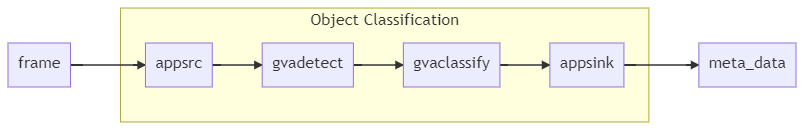

# OpenVINO™ DL Streamer – Edge AI Extension Module

| [Getting Started](#getting-started) | [Edge AI Extension Module Options](#edge-ai-extension-module-options) | [Additional Examples](#additional-standalone-edge-ai-extension-examples) | [Test Client](#test-client) |
[Changing Models](#updating-or-changing-detection-and-classification-models)

The OpenVINO™ DL Streamer - Edge AI Extension module is a microservice based on [Video Analytics Serving](/README.md) that provides video analytics pipelines built with OpenVINO™ DL Streamer. Developers can send decoded video frames to the AI Extension module which performs detection, classification, or tracking and returns the results. The AI Extension module exposes gRPC APIs that are compatible with [Live Video Analytics on IoT Edge](https://azure.microsoft.com/en-us/services/media-services/live-video-analytics/). Powered by OpenVINO™ toolkit, the AI Extension module enables developers to build, optimize and deploy deep learning inference workloads for maximum performance across Intel® architectures.

## Highlights:

- Scalable, high-performance solution for serving video analytics pipelines on Intel® architectures
- Pre-loaded Object Detection, Object Classification and Object Tracking pipelines to get started quickly
- Pre-loaded [person-vehicle-bike-detection-crossroad-0078](https://github.com/openvinotoolkit/open_model_zoo/blob/master/models/intel/person-vehicle-bike-detection-crossroad-0078/description/person-vehicle-bike-detection-crossroad-0078.md) and [vehicle-attributes-recognition-barrier-0039](https://github.com/openvinotoolkit/open_model_zoo/blob/master/models/intel/vehicle-attributes-recognition-barrier-0039/description/vehicle-attributes-recognition-barrier-0039.md) models.
- gRPC API enabling fast data transfer rate and low latency
- Validated support for [Live Video Analytics on IoT Edge](https://azure.microsoft.com/en-us/services/media-services/live-video-analytics/).
- Supported Configuration: Pre-built Ubuntu Linux container for CPU and iGPU

## What's New

- Addition of [line crossing](pipelines/object_tracking/line_crossing/README.md) and [zone counting](pipelines/object_detection/zone_events/README.md) spatial analytic pipelines
- Allow definition properties to be added to the [extensions](https://github.com/Azure/live-video-analytics/blob/master/contracts/data-schema/Extension%20Data%20Schema.json#L322) field in results
- Scaling has been removed from topology file as DL Streamer will automatically scale to match selected model
- Add `XPU` operations file that runs three pipelines executing detection inference on CPU, GPU and VPU (NCS2) respectively.


# Getting Started

The OpenVINO™ DL Streamer - Edge AI Extension module can run as a standalone microservice or as a module within an Live Video Analytics graph. For more information on deploying the module as part of a Live Video Analytics graph please see [Configuring the AI Extension Module for Live Video Analytics](#configuring-the-ai-extension-module-for-live-video-analytics) and refer to the [Live Video Analytics documentation](https://azure.microsoft.com/en-us/services/media-services/live-video-analytics/). The following instructions demonstrate building and running the microservice and test client outside of Live Video Analytics.

## Building the Edge AI Extension Module Image

### Prerequisites
Building the image requires a modern Linux distro with the following packages installed:

| |                  |
|---------------------------------------------|------------------|
| **Docker** | Video Analytics Serving requires Docker for it's build, development, and runtime environments. Please install the latest for your platform. [Docker](https://docs.docker.com/install). |
| **bash** | Video Analytics Serving's build and run scripts require bash and have been tested on systems using versions greater than or equal to: `GNU bash, version 4.3.48(1)-release (x86_64-pc-linux-gnu)`. Most users shouldn't need to update their version but if you run into issues please install the latest for your platform. Instructions for macOS&reg;* users [here](/docs/installing_bash_macos.md). |

### Building the Image:

Run the docker image build script.
```
$ ./docker/build.sh
```
Resulting image name is `video-analytics-serving:0.5.2-dlstreamer-edge-ai-extension`

## Running the Edge AI Extension Module

To run the module as a standalone microservice with an `object_detection` pipeline use the `run_server.sh` script with default options. For examples of additional options see [Additional Standalone Edge AI Extension Examples](#additional-standalone-edge-ai-extension-examples).

```bash
$ ./docker/run_server.sh
<snip>
{"levelname": "INFO", "asctime": "2021-01-22 15:27:00,009", "message": "Starting DL Streamer Edge AI Extension on port: 5001", "module": "__main__"}
```

## Sending a Test Frame for Object Detection

To send a test frame to the microservice and receive `object_detection` results use the `run_client.sh` script.

```bash
$ ./docker/run_client.sh
[AIXC] [2021-01-22 15:28:06,956] [MainThread  ] [INFO]: =======================
[AIXC] [2021-01-22 15:28:06,957] [MainThread  ] [INFO]: Options for __main__.py
[AIXC] [2021-01-22 15:28:06,957] [MainThread  ] [INFO]: =======================
[AIXC] [2021-01-22 15:28:06,957] [MainThread  ] [INFO]: grpc_server_address == localhost:5001
[AIXC] [2021-01-22 15:28:06,957] [MainThread  ] [INFO]: =======================
[AIXC] [2021-01-22 15:28:06,957] [MainThread  ] [INFO]: grpc_server_ip == localhost
[AIXC] [2021-01-22 15:28:06,957] [MainThread  ] [INFO]: =======================
[AIXC] [2021-01-22 15:28:06,957] [MainThread  ] [INFO]: grpc_server_port == 5001
[AIXC] [2021-01-22 15:28:06,957] [MainThread  ] [INFO]: =======================
[AIXC] [2021-01-22 15:28:06,957] [MainThread  ] [INFO]: sample_file == /home/video-analytics-serving/samples/lva_ai_extension/sampleframes/sample01.png
[AIXC] [2021-01-22 15:28:06,957] [MainThread  ] [INFO]: =======================
[AIXC] [2021-01-22 15:28:06,957] [MainThread  ] [INFO]: loop_count == 0
[AIXC] [2021-01-22 15:28:06,957] [MainThread  ] [INFO]: =======================
[AIXC] [2021-01-22 15:28:06,957] [MainThread  ] [INFO]: fps_interval == 2
[AIXC] [2021-01-22 15:28:06,957] [MainThread  ] [INFO]: =======================
[AIXC] [2021-01-22 15:28:06,957] [MainThread  ] [INFO]: frame_rate == -1
[AIXC] [2021-01-22 15:28:06,957] [MainThread  ] [INFO]: =======================
[AIXC] [2021-01-22 15:28:06,957] [MainThread  ] [INFO]: frame_queue_size == 200
[AIXC] [2021-01-22 15:28:06,957] [MainThread  ] [INFO]: =======================
[AIXC] [2021-01-22 15:28:06,958] [MainThread  ] [INFO]: use_shared_memory == False
[AIXC] [2021-01-22 15:28:06,958] [MainThread  ] [INFO]: =======================
[AIXC] [2021-01-22 15:28:06,958] [MainThread  ] [INFO]: output_file == /tmp/result.jsonl
[AIXC] [2021-01-22 15:28:06,958] [MainThread  ] [INFO]: =======================
[AIXC] [2021-01-22 15:28:07,341] [Thread-2    ] [INFO]: MediaStreamDescriptor request #1
[AIXC] [2021-01-22 15:28:07,364] [Thread-2    ] [INFO]: MediaSample request #2
[AIXC] [2021-01-22 15:28:07,365] [MainThread  ] [INFO]: [Received] AckNum: 1
[AIXC] [2021-01-22 15:28:07,371] [Thread-2    ] [INFO]: MediaSample request #3
[AIXC] [2021-01-22 15:28:07,940] [Thread-3    ] [INFO]: [Received] AckNum: 2
[AIXC] [2021-01-22 15:28:07,940] [MainThread  ] [INFO]: Inference result 2
[AIXC] [2021-01-22 15:28:07,941] [MainThread  ] [INFO]: - person (1.00) [0.30, 0.47, 0.09, 0.39] []
[AIXC] [2021-01-22 15:28:07,941] [MainThread  ] [INFO]: - person (0.97) [0.36, 0.40, 0.05, 0.24] []
[AIXC] [2021-01-22 15:28:07,941] [MainThread  ] [INFO]: - person (0.94) [0.44, 0.42, 0.08, 0.43] []
[AIXC] [2021-01-22 15:28:07,941] [MainThread  ] [INFO]: - person (0.92) [0.57, 0.38, 0.05, 0.25] []
[AIXC] [2021-01-22 15:28:07,941] [MainThread  ] [INFO]: - person (0.91) [0.69, 0.56, 0.12, 0.43] []
[AIXC] [2021-01-22 15:28:07,941] [MainThread  ] [INFO]: - person (0.90) [0.68, 0.42, 0.04, 0.24] []
[AIXC] [2021-01-22 15:28:07,941] [MainThread  ] [INFO]: - person (0.82) [0.64, 0.36, 0.05, 0.27] []
[AIXC] [2021-01-22 15:28:07,941] [MainThread  ] [INFO]: - person (0.60) [0.84, 0.44, 0.05, 0.29] []
[AIXC] [2021-01-22 15:28:07,943] [MainThread  ] [INFO]: Start Time: 1611347287.3661082 End Time: 1611347287.9434469 Frames Recieved: 1 FPS: 1.7320855292554225
[AIXC] [2021-01-22 15:28:07,943] [MainThread  ] [INFO]: Client finished execution
```

# Edge AI Extension Module Options

The module can be configured using command line options or environment variables (command line options take precedence).

| Setting             | Command line option   | Environment variable | Default value    |
|---------------------|-----------------------|----------------------|------------------|
| gRPC port           | -p                    | PORT                 | 5001             |
| Pipeline name       | --pipeline-name       | PIPELINE_NAME        | object_detection |
| Pipeline version    | --pipeline-version    | PIPELINE_VERSION     | person_vehicle_bike_detection |
| Use debug pipeline  | --debug               | DEBUG_PIPELINE       |                   |

## Video Analytics Pipelines

The following pipelines are included in the AI Extension:

| Name          | Version       | Definition      | Diagram |
| ------------- | ------------- | --------------- | ------- |
| object_detection | person_vehicle_bike_detection  | [definition](/samples/lva_ai_extension/pipelines/object_detection/person_vehicle_bike_detection/pipeline.json)||
| object_classification  | vehicle_attributes_recognition  | [definition](/samples/lva_ai_extension/pipelines/object_classification/vehicle_attributes_recognition/pipeline.json)||
| object_tracking  | person_vehicle_bike_tracking  | [definition](/samples/lva_ai_extension/pipelines/object_tracking/person_vehicle_bike_tracking/pipeline.json)||


## Configuring the AI Extension Module for Live Video Analytics

Based on HW target, choose and update the appropriate deployment manifest located in the [deployment directory](/samples/lva_ai_extension/deployment/).
* Make sure that the 'lvaExtension'->'image' property shows the Azure URI of VAS LVA Edge AI Extension docker image.
* Update the 'lvaExtension' -> 'ENV' property to configure container behavior. Our manifest file is configured for object detection by default.

You will also need to create a graph topology with gRPC extension and then create a graph instance based on that topology. Here is a sample [operations.json](/samples/lva_ai_extension/topologies/operations.json).

> **Note:** If using the C# sample [cloud-to-device-console-app](https://github.com/Azure-Samples/live-video-analytics-iot-edge-csharp/tree/master/src/cloud-to-device-console-app) ensure the nuget package `Microsoft.Azure.Devices` is version `1.33.0` or later.

### Topology files

Operations.json is an instruction set used by LVA to perform actions on the IOT Edge.
* You can set HW target using `extensionConfiguration` in operations.json file. Here is a sample, setting GPU as target [operations_gpu.json](/samples/lva_ai_extension/topologies/operations_gpu.json)

Topology.json is a config file used by operations.json to configure edge devices.

Operations.json can refer to the topology through a URL or a file path.

If changes are made locally to the topology file, the operations file will need change to point to the local topology.

Replace
```
topologyURL: <url to topology file>
```
to

```
topologyFile: <absolute path to topology file>
```

### Extension Configuration

The LVA Server supports the extension_configuration field in the [MediaStreamDescriptor message](https://github.com/Azure/live-video-analytics/blob/6495d58a5f7dc046ad9fb0f690c27a540a83fe45/contracts/grpc/extension.proto#L69). This field contains a JSON string that must match the extension configuration schema. See example below. Note that pipeline name and version fields are required but parameters and frame-destination are optional.
```
{
    "pipeline": {
        "name": "object_detection",
        "version": "person_vehicle_bike_detection",
        "parameters": {},
        "frame-destination": {}
    }
}
```

### Inference Accelerators

Pipelines can be configured to perform inference using a range of accelerators.
This is a two step process:
1. Give docker access to the accelerator's resources
2. Set the inference accelerator device name when starting the pipeline

See [Enabling Hardware Accelerators](/docs/running_video_analytics_serving.md#enabling-hardware-accelerators)
for details on docker resources and inference device name for supported accelerators.
This will allow you to customize the deployment manifest for a given accelerator.

The run server script will automatically detect installed accelerators and provide access to their resources.

Pipelines will define a default accelerator in their .json files. To run a pipeline on a different accelerator modify the pipeline json or send in a gRPC request with a extension_configuration. The LVA client generates this gRPC request with the extension configuration

Example extension_configuration
```
{
    "pipeline": {
        "name": "object_detection",
        "version": "person_vehicle_bike_detection"
        "parameters": { "detection-device": "GPU"}
    }
}
```

# Additional Standalone Edge AI Extension Examples

### Specifying VA Serving parameters for LVA Server

The LVA Server application will filter command line arguments between the LVA layer and VA Serving layer.
Command line arguments are first handled by run_server.sh; if not specifically handled by run_server.sh the argument
is passed into the LVA Server application.
Command line arguments that are not recognized by LVA Server are then passed to VA Serving, if VA Serving does not recognize
the arguments an error will be reported.

```bash
./docker/run_server.sh --log_level DEBUG
```

### Debug Mode

Debug pipelines can be selected using the `--debug` command line parameter or setting the `DEBUG_PIPELINE` environment variable. Debug pipelines save watermarked frames to `/tmp/vaserving/{--pipeline-version}/{timestamp}/` as JPEG images.

Run default pipeline in debug mode
```bash
$ ./docker/run_server.sh --debug
```

### Real Time Streaming Protocol (RTSP) Re-streaming

Pipelines can be configured to connect and visualize input video with superimposed bounding boxes.

* Enable RTSP at Server start
```
$ export ENABLE_RTSP=true
$ ./docker/run_server.sh
```
* Run client with frame destination set. For demonstration, path set as `person-detection` in example request below.
```
$ ./docker/run_client.sh --pipeline-name object_detection --pipeline-version person_vehicle_bike_detection --frame-destination '{\"type\":\"rtsp\",\"path\":\"person-detection\"}' --loop-count 1000
```
* Connect and visualize: Re-stream pipeline using VLC network stream with url `rtsp://localhost:8554/person-detection`.

* Example extension_configuration for re streaming pipeline.
```
{
    "pipeline": {
        "name": "object_detection",
        "version": "person_vehicle_bike_detection"
        "frame-destination": { "type":"rtsp", "path":"person-detection"}
    }
}
```

### Logging
Run the following command to monitor the logs from the docker container
```bash
$ docker logs video-analytics-serving_0.5.2-dlstreamer-edge-ai-extension -f
```

### Developer Mode
The server run script includes a `--dev` flag which starts the container in "developer" mode.
This mode runs with files from the host, not the container, which is useful for quick iteration and development.
```bash
$ ./docker/run_server.sh --dev
```

### Selecting Pipelines
>**Note:** These features are deprecated and will be removed in a future release. Please use extension configuration instead.

Specify the default pipeline via command line and run the server

```bash
$ ./docker/run_server.sh --pipeline-name object_classification --pipeline-version vehicle_attributes_recognition
```

Specify the default pipeline via environment variables and run the server
```
$ export PIPELINE_NAME=object_classification
$ export PIPELINE_VERSION=vehicle_attributes_recognition
$ ./docker/run_server.sh
```

Notes:
* If selecting a pipeline both name and version must be specified
* The `--debug` option selects debug pipelines that watermark inference results and saves images in `/tmp/vaserving/{--pipeline-version}/{timestamp}/` and can also be set using the environment variable DEBUG_PIPELINE

# Test Client
A test client is provided to demonstrate the capabilities of the Edge AI Extension module.
The test client script `run_client.sh` sends frames(s) to the extension module and prints inference results.
Use the --help option to see how to use the script. All arguments are optional.

```
$ ./docker/run_client.sh
All arguments are optional, usage is as follows
  [ -s : gRPC server address, defaults to None]
  [ --server-ip : Specify the server ip to connect to ] (defaults to 127.0.0.1)
  [ --server-port : Specify the server port to connect to ] (defaults to 5001)
  [ --sample-file-path : Specify the sample file path to run] (defaults to samples/lva_ai_extension/sampleframes/sample01.png)
  [ --loop-count : How many times to loop the source after it finishes ]
  [ --number-of-streams : Specify number of streams (one client process per stream)]
  [--fps-interval FPS_INTERVAL] (interval between frames in seconds, defaults to 0)
  [--frame-rate FRAME_RATE] (send frames at given fps, default is no limit)
  [--frame-queue-size : Max number of frames to buffer in client, defaults to 200]
  [ --shared-memory : Enables and uses shared memory between client and server ] (defaults to off)
  [ --output-file-path : Specify the output file path to save inference results in jsonl format] (defaults to /tmp/results.jsonl)
  [ --extension-config : JSON string or file containing extension configuration]
  [ --pipeline-name : Name of the pipeline to run]
  [ --pipeline-version : Name of the pipeline version to run]
  [ --pipeline-parameters : Pipeline parameters]
  [ --pipeline-extensions : JSON string containing tags to be added to extensions field in results]
  [ --frame-destination : Frame destination for rtsp restreaming]
  [ --dev : Mount local source code] (use for development)
  ```
Notes:
* If using `--extension-config`, you must not set any of the following options
  * --pipeline-name
  * --pipeline-version
  * --pipeline-parameters
  * --pipeline-extensions
  * --frame-destination
* Media or log file must be inside container or in volume mounted path
* Either png or mp4 media files are supported
* If not using shared memory, decoded image frames must be less than 4MB (the maximum gPRC message size)
* If you are behind a firewall ensure `no_proxy` contains `127.0.0.1` in docker config and system settings.

# Updating or Changing Detection and Classification Models
Before updating the models used by a pipeline please see the format of
[pipeline definition files](/docs/defining_pipelines.md) and read the
tutorial on [changing object detection models](/docs/changing_object_detection_models.md).

Most of the steps to changes models used by LVA extension are the same as for the above tutorial, but it assumes you are working with the REST service and not the AI
Extension module. The LVA specific steps are called out in the following sections.

## Run Existing Object Detection Pipeline
Get baseline results for existing object_detection model `person-vehicle-bike-detection-crossroad-0078`

```
$./docker/run_server.sh
<snip>
/object_classification/vehicle_attributes_recognition/pipeline.json", "module": "pipeline_manager"}
{"levelname": "INFO", "asctime": "2021-01-21 12:10:10,288", "message": "===========================", "module": "pipeline_manager"}
{"levelname": "INFO", "asctime": "2021-01-21 12:10:10,288", "message": "Completed Loading Pipelines", "module": "pipeline_manager"}
{"levelname": "INFO", "asctime": "2021-01-21 12:10:10,289", "message": "===========================", "module": "pipeline_manager"}
{"levelname": "INFO", "asctime": "2021-01-21 12:10:10,292", "message": "Starting DL Streamer Edge AI Extension on port: 5001", "module": "__main__"}
```

In a separate terminal:

```
$ ./docker/run_client.sh
<snip>
[AIXC] [2020-11-20 23:29:11,417] [MainThread  ] [INFO]: - person (1.00) [0.30, 0.47, 0.09, 0.39]
[AIXC] [2020-11-20 23:29:11,417] [MainThread  ] [INFO]: - person (0.97) [0.36, 0.40, 0.05, 0.24]
[AIXC] [2020-11-20 23:29:11,417] [MainThread  ] [INFO]: - person (0.94) [0.44, 0.42, 0.08, 0.43]
[AIXC] [2020-11-20 23:29:11,418] [MainThread  ] [INFO]: - person (0.92) [0.57, 0.38, 0.05, 0.25]
[AIXC] [2020-11-20 23:29:11,418] [MainThread  ] [INFO]: - person (0.91) [0.69, 0.56, 0.12, 0.43]
[AIXC] [2020-11-20 23:29:11,418] [MainThread  ] [INFO]: - person (0.90) [0.68, 0.42, 0.04, 0.24]
[AIXC] [2020-11-20 23:29:11,418] [MainThread  ] [INFO]: - person (0.82) [0.64, 0.36, 0.05, 0.27]
[AIXC] [2020-11-20 23:29:11,418] [MainThread  ] [INFO]: - person (0.60) [0.84, 0.44, 0.05, 0.29]
<snip>
```

## Send a request to the server to run a different pipeline
```
$ ./docker/run_client.sh --pipeline-name object_classification --pipeline-version vehicle_attributes_recognition
```

## Send a request to the server to run a different pipeline on the GPU
```
$ ./docker/run_client.sh --pipeline-name object_detection --pipeline-version person_vehicle_bike_detection --pipeline-parameters '{"detection-device":"GPU"}'
```

## Add New Model to Models List

Copy the existing model list `models/models.list.yml` to `models/yolo-models.list.yml` then add the following entry:

```yml
- model: yolo-v2-tiny-tf
  alias: yolo
  version: 1
  precision: [FP16,FP32]
```

## Update Pipeline Definition File to Use New Model

Copy, rename and update the existing object detection pipeline to reference `yolo-v2-tiny-tf` model:

```bash
$ cp -r pipelines/object_detection/person_vehicle_bike_detection pipelines/object_detection/yolo
$ sed -i -e s/person_vehicle_bike_detection/yolo/g pipelines/object_detection/yolo/pipeline.json
```

## Rebuild Edge AI Extension with new Model and Pipeline

```
$ ./docker/build.sh --models models/yolo-models.list.yml
```

The model will now be in `models` folder in the root of the project:

```
models
└── yolo
    └── 1
        ├── FP16
        │   ├── yolo-v2-tiny-tf.bin
        │   ├── yolo-v2-tiny-tf.mapping
        │   └── yolo-v2-tiny-tf.xml
        ├── FP32
        │   ├── yolo-v2-tiny-tf.bin
        │   ├── yolo-v2-tiny-tf.mapping
        │   └── yolo-v2-tiny-tf.xml
        └── yolo-v2-tiny-tf.json
```

Check that expected model and pipeline are present in the built image:

```bash
$ docker run -it --entrypoint /bin/bash video-analytics-serving:0.5.2-dlstreamer-edge-ai-extension
vaserving@82dd59743ca3:~$ ls models
person_vehicle_bike_detection  vehicle_attributes_recognition  yolo
vaserving@82dd59743ca3:~$  ls pipelines/object_detection/
debug_person_vehicle_bike_detection  person_vehicle_bike_detection  yolo
```

## Run Edge AI Extension with new Model and Pipeline

### Re-start service
Restart the service to ensure we are using the image with the yolo-v2-tiny-tf model
```
$ docker stop video-analytics-serving:0.5.2-dlstreamer-edge-ai-extension
$ docker/run_server.sh --pipeline-name object_detection --pipeline-version yolo
```
### Run the client
Note different results due to different model
```
$ docker/run_client.sh
<snip>
[AIXC] [2021-01-07 06:51:13,081] [MainThread  ] [INFO]: - person (0.82) [0.63, 0.36, 0.06, 0.24] []
[AIXC] [2021-01-07 06:51:13,081] [MainThread  ] [INFO]: - person (0.78) [0.56, 0.37, 0.06, 0.23] []
[AIXC] [2021-01-07 06:51:13,081] [MainThread  ] [INFO]: - person (0.63) [0.44, 0.43, 0.11, 0.43] []
[AIXC] [2021-01-07 06:51:13,081] [MainThread  ] [INFO]: - person (0.63) [0.31, 0.45, 0.09, 0.23] []
[AIXC] [2021-01-07 06:51:13,081] [MainThread  ] [INFO]: - person (0.62) [0.69, 0.38, 0.06, 0.23] []
[AIXC] [2021-01-07 06:51:13,081] [MainThread  ] [INFO]: - person (0.60) [0.40, 0.44, 0.07, 0.27] []
[AIXC] [2021-01-07 06:51:13,081] [MainThread  ] [INFO]: - person (0.59) [0.45, 0.43, 0.08, 0.29] []
[AIXC] [2021-01-07 06:51:13,082] [MainThread  ] [INFO]: - person (0.57) [0.33, 0.40, 0.07, 0.20] []
[AIXC] [2021-01-07 06:51:13,082] [MainThread  ] [INFO]: - person (0.57) [0.76, 0.46, 0.13, 0.23] []
[AIXC] [2021-01-07 06:51:13,082] [MainThread  ] [INFO]: - person (0.55) [0.41, 0.44, 0.03, 0.10] []
<snip>
```
