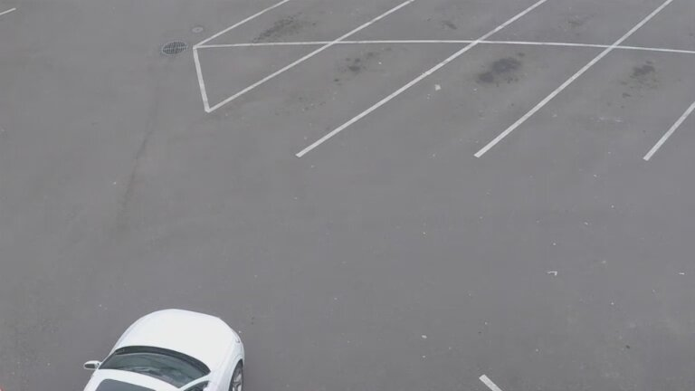

# Saving and Retrieving Frames
| [Introduction](#Introduction)
| [Modify Pipeline to Save Frames](#Modify-Pipeline-to-Save-Frames)
| [Retrieving Frames](#Retrieving-Frames)
| [MQTT Save and Retrieve Frame Sample](#MQTT-Save-and-Retrieve-Frame-Sample)

## Introduction
Inference results generated by VA Serving pipelines can be sent to a "destination" module that analyzes them,
often to generate "events" (e.g. an object is in a pre-defined zone).
In some scenarios the observing module may wish to save or display the frame that generated the event.

There are three sections in this document:
1. Modifying a pipeline definition file to add ability to record frames.
2. Setting pipeline parameters that configure frame storage and then showing how to retrieve the stored frames.
3. Running the sample that displays the frame where the first vehicle is detected.

## Modifying a Pipeline to Save Frames

When customizing an existing pipeline to record frames and perform inference we will make use of the standard GStreamer elements [tee](https://gstreamer.freedesktop.org/documentation/coreelements/tee.html?gi-language=c), [jpegenc](https://gstreamer.freedesktop.org/documentation/jpeg/jpegenc.html?gi-language=c) and [multifilesink](https://gstreamer.freedesktop.org/documentation/multifile/multifilesink.html)

* `tee` splits a pipeline into _N_ branches which can then operate on a frame in parallel. In this example we use a tee element to split a pipeline into two branches.  The first branch generates inference results while the second branch saves frames as jpeg images for later retrieval.
* `jpegenc` encodes incoming buffers into jpeg images. In this example we use jpegenc to transform raw decoded images into jpeg images that can be saved and retrieved for display.
* `multifilesink` saves incoming buffers to a customizable location on disk. In this example we use the element to save frames to disk with a specific naming pattern based on the frame index.

### Updating a Pipeline Template
We will use the `object_detection/person_vehicle_bike` pipeline as an example to demonstrate how to modify an existing pipeline to save frames.

The original pipeline template is shown below:

```
"template": ["uridecodebin name=source",
				" ! gvadetect model={models[object_detection][person_vehicle_bike][network]} name=detection",
				" ! gvametaconvert name=metaconvert ! gvametapublish name=destination",
				" ! appsink name=appsink"
			],
```

To encode and save frames for later retrieval extend the pipeline as follows:

1. Where the decoded frame is first available, insert tee element (named `t`) followed by a queue element. In this example it goes after `uridecodebin` which produces the decoded frame.
2. Insert a `queue` element after the tee to prevent the pipeline from blocking if one branch takes longer than the other.
3. After `gvametaconvert` insert the `gvapython` element that adds a frame count to the inference meta-data. The client will use this data to create the filename for the corresponding frame.
4. After `appsink` insert the other half of the fork that encodes and saves the files: `queue ! videoconvert ! jpegenc ! multifilesink name=sink`.


The updated template is shown below:

```
"template": ["uridecodebin name=source",
                " ! tee name=t ! queue "
                " ! gvadetect model={models[object_detection][person_vehicle_bike][network]} name=detection",
                " ! gvametaconvert name=metaconvert",
                " ! gvapython name=gvapython module=/home/video-analytics-serving/extensions/add_frame_id.py class=FrameCounter",
                " ! gvametapublish name=destination",
                " ! appsink name=appsink"
                " t. ! queue ! videoconvert ! jpegenc ! multifilesink name=filesink"
			],
```

### Pipeline Parameters

To enable clients to customize the number of frames stored as well as the location of stored frames we add the following pipeline parameters to expose selected properties of the [multifilesink](https://gstreamer.freedesktop.org/documentation/multifile/multifilesink.html) element.

* **max-files** will set a limit on number of files created (erasing the oldest generated files). Default is 1000 which is just over 30s assuming 30fps content. A value of 0 indicates no limit.

* **file-location** is the path specifier for generating filenames that uses the [c language printf specifier format](https://www.cplusplus.com/reference/cstdio/printf/).

```
"max-files": {
    "element": "filesink",
    "type": "integer",
    "default": 1000
},
"file-location": {
    "element": "filesink",
    "type": "string",
    "default": "/tmp/%08d.jpg"
}
```

## Retrieving Frames

This section covers the steps to execute a pipeline with frames stored to a specific location and for a client to retrieve a specific frame later.

### Choosing a frame store location and starting the service
First choose a frame store location.
> **Note:** Make sure the directory is created and writeable by all so that pipeline can write frames into it.

In the following examples we use:

`/path/to/samples/record_frames/frame_store`

Next start the service, ensuring the following
* the updated pipeline with frame recording support is in the REST service image (or volume mounted)
* the gvapython frame counting extension in in the REST service image in `/home/video-analytics-serving/extensions` (or volume mounted)
* the frame store location is volume mounted (`-v /path/to/samples/record_frames/frame_store:/path/to/samples/record_frames/frame_store`)

### Starting the pipeline

Start the pipeline
* Specify the frame store file specifier (via the file-location parameter).
* Request would look like this in curl format assume pipeline is `object_detection/record_frames`
```
curl localhost:8080/pipelines/object_detection/record_frames -X POST -H \
'Content-Type: application/json' -d \
'{
  "source": {
    "uri": "https://github.com/intel-iot-devkit/sample-videos/blob/master/car-detection.mp4?raw=true",
    "type": "uri"
  },
  "destination": {
    "metadata": {
      "type": "file",
      "path": "/tmp/results.jsonl",
      "format": "json-lines"
    }
  },
  "parameters": {
    "file-location": "/path/to/samples/record_frames/frame_store/%08d.jpg"
  }
}'
```

### Retrieving a Frame based on Meta-Data

Start a client that consumes meta-data. The client must be given the frame store filename specifier (i.e. /path/to/samples/record_frames/frame_store/%08d.jpg)
* Set up a results handler to receive inference results and determine when "event" happened. For a simple test it can say the 100th object to be detected.
* In result object look for the `frame_id` field, it contains the frame count. In this object it's 587
```json
{
   "objects": [
      {
            "detection": {
               "bounding_box": {
                  "x_max": 0.09885172545909882,
                  "x_min": 0.003643408417701721,
                  "y_max": 0.35827890038490295,
                  "y_min": 0.12642857432365417
               },
               "confidence": 0.7773288488388062,
               "label": "vehicle",
               "label_id": 2
            },
            "h": 100,
            "roi_type": "vehicle",
            "w": 73,
            "x": 3,
            "y": 55
      }
   ],
   "resolution": {
      "height": 432,
      "width": 768
   },
   "source": "https://github.com/intel-iot-devkit/sample-videos/blob/master/person-bicycle-car-detection.mp4?raw=True",
   "timestamp": 48916666666,
   "frame_id": 587
}
```

* Combine the filename specifier `/path/to/samples/record_frames/frame_store/%08d.jpg` with frame_id `587` to get path to frame `/path/to/samples/record_frames/frame_store/00000587.jpg"`

## MQTT Save and Retrieve Frame Sample
The sample includes the following to show frame saving and retrieval in action
* pipeline with frame recording support
* gvapython extension that adds frame_id to the inference meta-data
* script to start service and volume mount folders for gvapython extension and frame store
* script to start pipeline with frame store filename specifier then start mqtt client
* an mqtt client that subscribes to inference meta-data and displays the frame where the first vehicle was detected

### Server
For the frame store path we'll keep with `/path/to/samples/record_frames/frame_store`.

The server must do two things:
1. Mount the folder with the `add_frame_id` extension to `home/video-analytics-server/extensions`
2. Mount the frame store

Then run script as follows:
```
samples/record_frames/run_server.sh --frame-store samples/record_frames/frame_store
```

Check the pipeline is loaded:
```
vaclient/vaclient.sh list-pipelines
```
```
<snip>
 - object_detection/record_frames
```

### MQTT Broker
In a different terminal start the mqtt broker:
```
docker run --network=host -d eclipse-mosquitto:1.6
```

### Client
The run_client script does the following:
* Uses the `frame-store` argument to specify frame store directory.
* Sets the filename specifier to `%08d`
* Starts the file saving pipeline with following request
   * meta-data destination is mqtt with topic of `vaserving`
   * parameter `file-location` which combines the `--frame-store` argument and file specifier to create `/path/to/samples/record_frames/frame_store/%08d.jpg`
* Starts the python mqtt client that looks for the first vehicle in the stream and displays it image.
   * Connects to broker and subscribes to mqtt topic `vaserving`
   * Listens for inference results with type `vehicle` above 75% confidence
   * Gets `frame_id` from meta-data and applies to filename specifier. As example, a `frame_id` value of 174 would map to path `/path/to/samples/record_frames/frame_store/00000174.jpg`
   * Displays image from file `/path/to/samples/record_frames/frame_store/00000174.jpg`

Run the script as follows
```
samples/record_frames/run_client.sh --frame-store samples/record_frames/frame_store
```
```
<snip>
Starting pipeline object_detection/record_frames, instance = 1
Frame store file location = /path/to/video-analytics-serving/samples/record_frames/frame_store/%08d.jpg
Starting mqtt client
Connected to broker
Subscribing to topic vaserving
Detected vehicle: frame_id = 174
Frame path: /path/to/video-analytics-serving/samples/record_frames/frame_store/00000174.jpg
```
File `00000174.jpg` will then be displayed.

